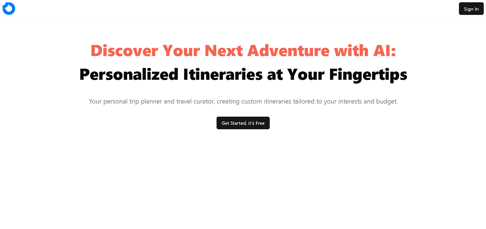

# AI-Trip-Planner

AI-Trip-Planner is a React-based application that leverages AI to provide personalized hotel recommendations and curated travel itineraries. Users can discover the best places to stay and visit, tailored to their preferences and travel plans, all in one seamless experience.

## Image

<a href='https://trip-planner-ai-six.vercel.app' target='_blank'>

</a>

## View Live

<a href='https://trip-planner-ai-six.vercel.app' target='_blank'>Live</a>

## Features

- **AI-Powered Recommendations**: Utilize Gemini AI to suggest hotels and places to visit based on user preferences.
- **Personalized Itineraries**: Generate custom travel plans that align with individual interests and schedules.
- **Real-Time Data**: Firebase integration ensures that all data is up-to-date and securely stored.
- **Responsive Design**: Built with Tailwind CSS for a clean, modern, and mobile-friendly interface.

## Tech Stack

- **React**: Front-end library for building user interfaces.
- **Gemini AI**: AI model used for generating personalized recommendations.
- **Firebase**: Backend as a service for real-time database, authentication, and hosting.
- **Tailwind CSS**: Utility-first CSS framework for designing responsive UIs.

## Installation

1. Clone the repository:
    ```bash
    git clone https://github.com/your-username/AI-Trip-Planner.git
    cd AI-Trip-Planner
    ```

2. Install dependencies:
    ```bash
    npm install
    ```

3. Set up Firebase:
    - Create a Firebase project on the [Firebase Console](https://console.firebase.google.com/).
    - Add your Firebase configuration to the `.env` file:

4. Start the development server:
    ```bash
    npm start
    ```

## Usage

- **Home Page**: Enter your destination and preferences.
- **Hotel Recommendations**: View AI-suggested hotels tailored to your needs.
- **Itinerary Planner**: Receive a custom itinerary based on your inputs.
- **Save & Share**: Save your plans and share them with others.

## Contributing

Contributions are welcome! Please feel free to submit a Pull Request.

## License

This project is licensed under the MIT License - see the [LICENSE](LICENSE) file for details.

## Contact

For any questions or suggestions, please reach out to [your-changansarvesh0@gmail.com](mailto:your-changansarvesh0@gmail.com).
